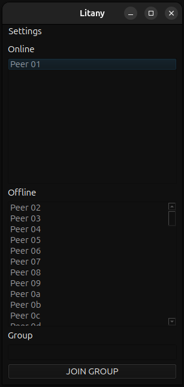
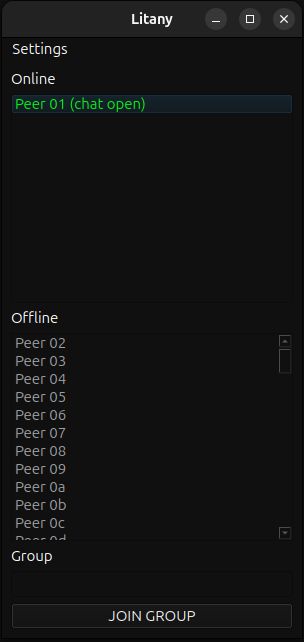
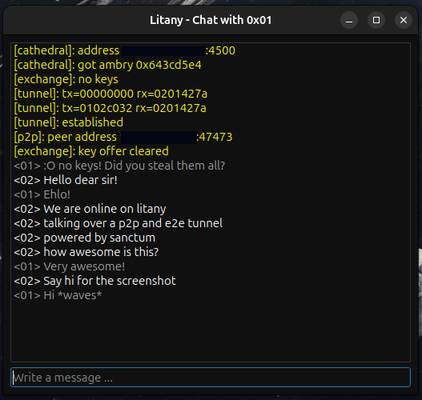

# Litany

Essentially E2EE and P2P chat using the sanctum protocol, wrapped
in a Qt application because people dislike my terminal approach to
everything.

You can have one-to-one conversations or group conversations. With
group conversations you have tunnels to each participant in the group.

This is a WIP and the UI is wonky, I am not a GUI person.

Double click on a peer to open its chat window (spawned
as a separate process), your peer needs to do the same right
now as there is no signaling yet.

Messages are limited to 512 bytes each.

Messages are resent if a peer does not ACK a message after 5 seconds.

## Building

You need Qt6 and libkyrka with its dependencies installed.

```
$ qmake qt/litany.pro
$ make -j
```

## Configuration

The litany requires a JSON based configuration that contains
the relevant information for your terminal.

```
{
    "flock": "493abf95a07e0c00",
    "kek-id": "0d",
    "flock-domain": "0b",
    "flock-domain-group": "0c",
    "kek-path": "493abf95a07e0c00-0x0d/kek-0x0d",
    "cs-id": "e365d227",
    "cs-path": "493abf95a07e0c00-0x0d/id-e365d227",
    "cathedral": "ip:port"
}
```

By default litany will attempt to open this based on
QStandardPaths::AppDataLocation, or you can specify
it on the cli with -c when starting litany.

## Screenshots




